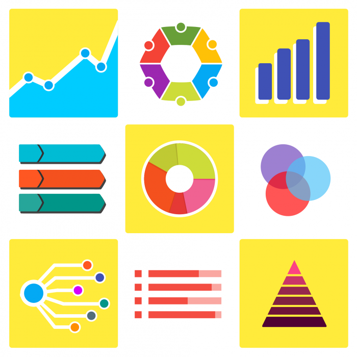

# 30DayChartChallenge
Octubre 2024

Aquí se encontrará 30 gráficos creados y organizados por categorías. 
|  |  |  |  |  |
| Comparisons | Distributions | Relationships | Timeseries | Uncertainties |
|--------------|----------------|------------|-------------------|----------------|
| [01. Part-to-whole](#) | [07. Peligros](#) | [13. Familia](#) | [19. Dinosaurios](#) | [25. Cambio global](#) |
| [02. Neo](#) | [08. Circular](#) | [14. Heatmap](#) | [20. Correlación](#) | [26. IA](#) |
| [03. Makeover](#) | [09. Mayor/menor](#) | [15. Histórico](#) | [21. Energía verde](#) | [27. Bueno/malo](#) |
| [04. Waffle](#) | [10. Físico](#) | [16. Clima](#) | [22. Movilidad](#) | [28. Tendencia](#) |
| [05. Divergente](#) | [11. Mobile-friendly](#) | [17. Redes](#) | [23. Mosaicos](#) | [29. Blanco y negro](#) |
| [06. OCDE](#) | [12. Reuters Graphics](#) | [18. Asian Development Bank](#) | [24. ILO África](#) | [30. FiveThirtyEight](#) |

---

# #300DayChartChallenge - Abril 2024

  

## 📊 Categorías 

| Comparaciones         | Distribuciones       | Relaciones          | Series Temporales   | Incertidumbres      |
|-----------------------|----------------------|---------------------|---------------------|---------------------|
|  |  |  |  |  |
| [01. Part-to-whole](#) | [07. Peligros](#)    | [13. Familia](#)    | [19. Dinosaurios](#)| [25. Cambio global](#) |
| [02. Neo](#)          | [08. Circular](#)    | [14. Heatmap](#)    | [20. Correlación](#)| [26. IA](#)          |

## Cómo navegar:
1. Haz clic en cualquier enlace de la tabla para ir al gráfico correspondiente.
2. Cada gráfico incluye: código fuente (ej. R, Python), datos utilizados y una breve explicación.

¡Gracias por visitar! 🚀
